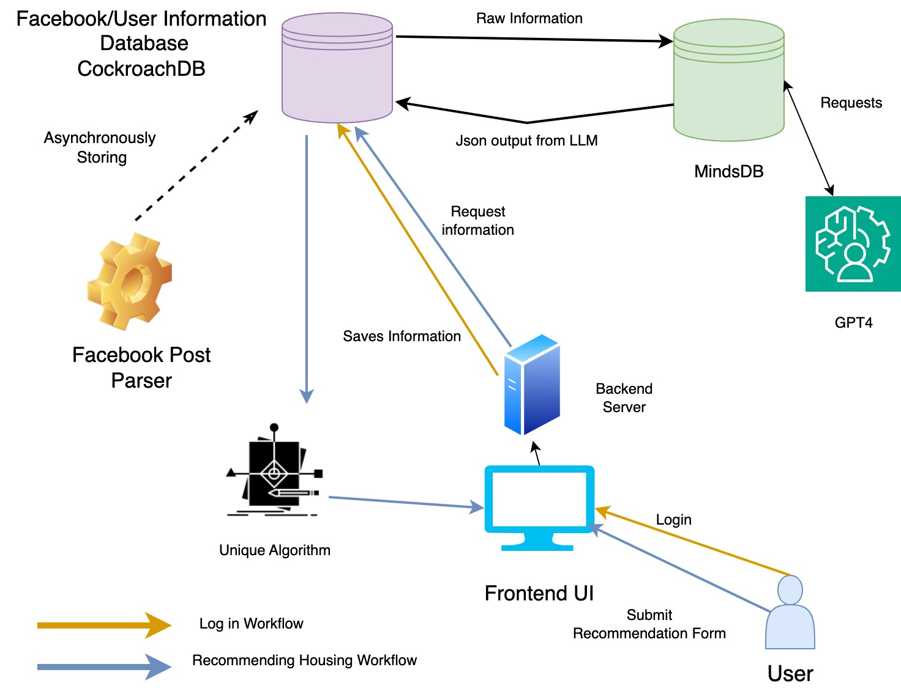

# My Housing Search Journey: From Frustration to Innovation

As a former student, I personally experienced the frustration and challenges of finding suitable housing near the campus. The scattered information, countless websites, and tedious manual searches made the process daunting. This personal experience inspired me to create [Your Startup Name], a revolutionary platform to transform the way people find their dream homes.

## **Inspiration**
The idea behind [Your Startup Name] was born from my own struggles. I understood the pain points of students and professionals looking for housing near dynamic regions like Berkeley. I wanted to eliminate the compromise between price and distance, making the entire process more efficient, personalized, and stress-free.

## **What I Learned**
My journey involved diving deep into the real estate market, understanding the nuances of different neighborhoods, and learning about the preferences and pain points of prospective renters. I also delved into the potential of advanced AI technologies to solve these problems.

## **Building the Project**
- **Market Research**: I conducted extensive market research to identify gaps in the existing housing search platforms and the unique needs of our target audience.

- **AI Integration**: Leveraging cutting-edge AI technology, I worked with a team of experts to develop algorithms that could process user preferences and property data efficiently, providing tailored recommendations.

- **User-Centric Design**: We designed the platform with the user in mind, making it intuitive, easy to navigate, and highly customizable. Users can specify their budget, proximity to Berkeley, and other preferences with just a few clicks.

- **Partnerships**: We forged partnerships with real estate agencies, property managers, and landlords to ensure a wide and updated database of housing options.

- **Feedback Loop**: We established a feedback loop with users to continuously improve the platform, incorporating their suggestions and refining our algorithms.

## **Challenges**
- **Data Integration**: Gathering and integrating property data from various sources was a significant challenge. Ensuring the data was up-to-date and accurate required a dedicated effort.

- **Algorithm Refinement**: Developing AI algorithms that could accurately predict the ideal housing options for users while considering their individual preferences and budgets was complex and required continuous refinement.

- **Competitive Market**: The real estate and housing market is highly competitive. We faced challenges in differentiating ourselves and gaining trust among users.

- **Scalability**: As the platform gained popularity, scaling the technology and customer support to handle the increasing user base presented a significant challenge.

## **Conclusion**
My personal experience as a student struggling to find suitable housing near the campus was the driving force behind the creation of [Your Startup Name]. Through dedication, innovation, and a commitment to solving the challenges of housing searches, we've built a platform that offers a streamlined, efficient, and personalized solution. Our mission is to ensure that no one has to compromise when finding their ideal home, and we're excited to continue improving and expanding our services in the future.
